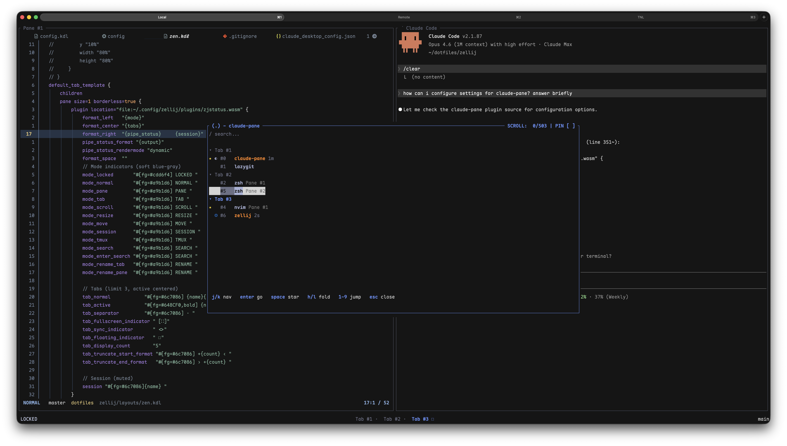

# zellij-pane-palette

A [Zellij](https://zellij.dev) WASM plugin for managing AI coding sessions and panes — fuzzy search, bookmarks, process display, and background notifications.



## Features

- **Command palette** — fuzzy-searchable pane picker with fold/unfold tabs, jump numbers (1-9), running command display
- **Background flash** — pane background blinks when Claude needs attention (permission, notification); clears on focus
- **Star bookmarks** — pin important panes, cycle through them with Alt+U/I across tabs
- **Running indicator** — orange text for active Claude sessions, green for Codex
- **Process display** — shows foreground process for all panes (zsh, nvim, claude, codex, etc.)
- **Hook bridge** — zero-config if you use Claude Code's hook system

## Quick Start

### Requirements

- Zellij >= 0.44.0

### Install

**Option A: `/install` skill (recommended)**

Open Claude Code inside Zellij and run `/install`. The skill detects your environment and configures everything interactively.

**Option B: Manual**

1. Download `zellij-pane-palette.wasm` from the [latest release](https://github.com/jiehoonk/zellij-pane-palette/releases)
2. Copy to `~/.config/zellij/plugins/zellij-pane-palette.wasm`
3. Add to your `config.kdl`:

```kdl
plugins {
    pane-palette location="file:~/.config/zellij/plugins/zellij-pane-palette.wasm" {
        notification_flash "persist"
        done_timeout_s     "30"
        idle_remove_s      "300"
    }
}

load_plugins {
    "pane-palette"
}
```

4. Add keybinds to open the palette and cycle starred panes:

```kdl
keybinds {
    locked {
        bind "Alt o" {
            MessagePlugin "pane-palette" {
                name "show"
            }
        }
        bind "Alt u" {
            MessagePlugin "pane-palette" {
                name "star-prev"
            }
        }
        bind "Alt i" {
            MessagePlugin "pane-palette" {
                name "star-next"
            }
        }
    }
}
```

5. Register the hook bridge:

```bash
cp scripts/pane-palette-hook.sh ~/.config/zellij/plugins/
chmod +x ~/.config/zellij/plugins/pane-palette-hook.sh
```

Add to `~/.claude/settings.json`:

```json
{
  "hooks": {
    "PreToolUse": [{ "command": "~/.config/zellij/plugins/pane-palette-hook.sh" }],
    "PostToolUse": [{ "command": "~/.config/zellij/plugins/pane-palette-hook.sh" }],
    "Notification": [{ "command": "~/.config/zellij/plugins/pane-palette-hook.sh" }],
    "Stop": [{ "command": "~/.config/zellij/plugins/pane-palette-hook.sh" }],
    "UserPromptSubmit": [{ "command": "~/.config/zellij/plugins/pane-palette-hook.sh" }]
  }
}
```

## Command Palette

| Key | Action |
|-----|--------|
| `j` / `k` | Navigate up/down |
| `Enter` | Focus selected pane |
| `Space` | Toggle star bookmark |
| `h` / `l` | Fold/unfold tab group |
| `1`-`9` | Jump to Nth visible entry |
| `Backspace` | Delete search character |
| `Esc` | Close palette |
| Type | Fuzzy search |

## Pipe Messages

| Name | Payload | Effect |
|------|---------|--------|
| `show` / `pane-palette:show` | — | Open palette |
| `hide` / `pane-palette:hide` | — | Close palette |
| `star-next` / `pane-palette:star-next` | — | Focus next starred pane |
| `star-prev` / `pane-palette:star-prev` | — | Focus previous starred pane |
| `focus` / `pane-palette:focus` | FocusPayload JSON | Direct pane focus with flash |
| `pane-palette:event` / `event` | HookPayload JSON | Upsert session |
| `dump-state` / `pane-palette:dump-state` | — | Write state diagnostic |
| `test` / `pane-palette:test` | — | Test ping |

## Activity Symbols

| Symbol | Activity | Color |
|--------|----------|-------|
| ◐ | Thinking | `#a9b1d6` |
| ◎ | Reading | `#0074d9` |
| ✎ | Writing | `#4166F5` |
| ⚡ | Bash/Shell | `#ff851b` |
| ◍ | Web Search | `#0074d9` |
| ▶ | Agent/MCP | `#b10dc9` |
| ✓ | Done | `#2ecc40` |
| ⚠ | Permission Needed | `#ff4136` |
| ○ | Idle | `#6c7086` |

## Configuration

```kdl
pane-palette location="file:~/.config/zellij/plugins/zellij-pane-palette.wasm" {
    // Palette keybindings
    key_select_down    "j"
    key_select_up      "k"
    key_confirm        "Enter"
    key_cancel         "Esc"
    key_toggle_star    "Space"
    key_delete_char    "Backspace"

    // Notification behavior
    notification_flash "persist"    // persist | brief | off
    flash_duration_ms  "2000"
    done_timeout_s     "30"
    idle_remove_s      "300"

    // Display
    show_elapsed_time  "true"
    show_non_claude    "true"

    // Focus highlight
    focus_highlight_s  "0.5"
}
```

## Build from Source

```bash
rustup target add wasm32-wasip1
cargo build --release
# → target/wasm32-wasip1/release/zellij-pane-palette.wasm
```

## References

**Zellij + Claude Code**
- [claude-code-zellij-status](https://github.com/thoo/claude-code-zellij-status) — Monitor Claude Code activity via zjstatus
- [claude-zellij-whip](https://github.com/rvcas/claude-zellij-whip) — Claude Code notifications for Zellij with pane focusing

**Zellij Plugins**
- [zellij-pane-picker](https://github.com/shihanng/zellij-pane-picker) — Floating pane switcher with filtering and starring

## License

MIT
